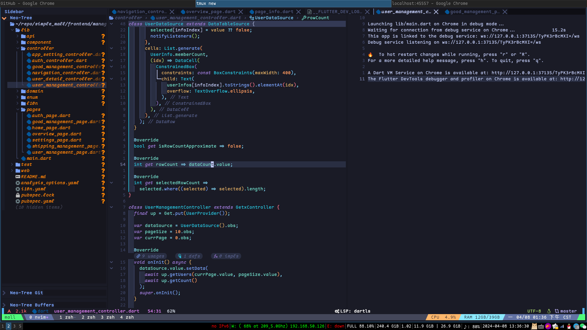
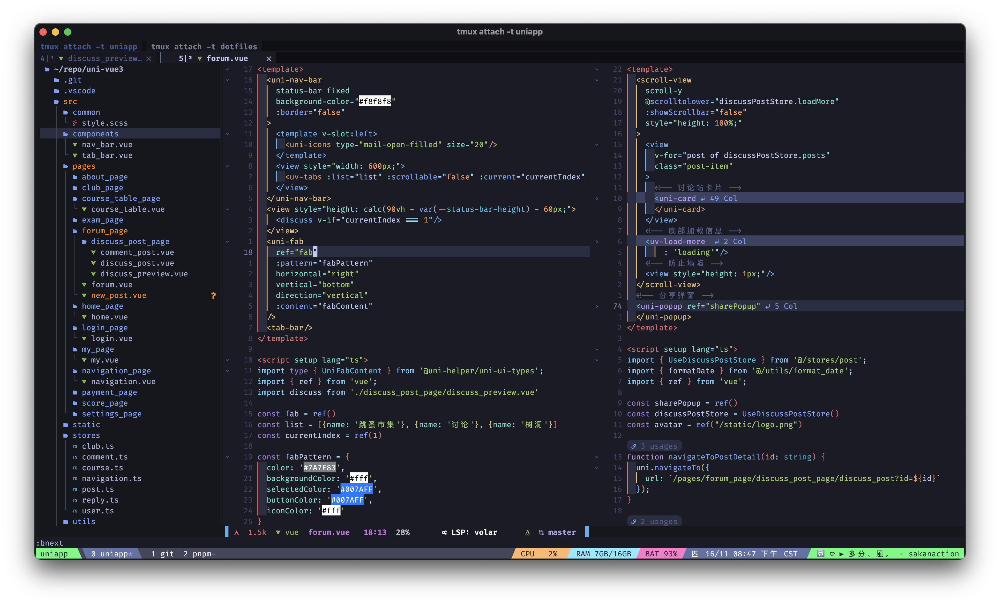

# Personal NeoVim repo




## How to use?

### Clone config

```bash
cd ~/.config
git clone https://github.com/gaogao-qwq/nvim.git
```

### Install tree-sitter

> Arch Linux AUR

```bash
yay -S tree-sitter
```

> Debian or Ubuntu

```bash
sudo apt install tree-sitter
```

> macOS Homebrew

```bash
brew install tree-sitter
```

### (Optional)Install jdtls for java LSP support

```bash
just jdtls # Tested on Arch Linux & MacOS.
```

### Install plugins by lazy

Then just open NeoVim and have a nice cup of Libre-tea until Lazy handles
all the problems.
