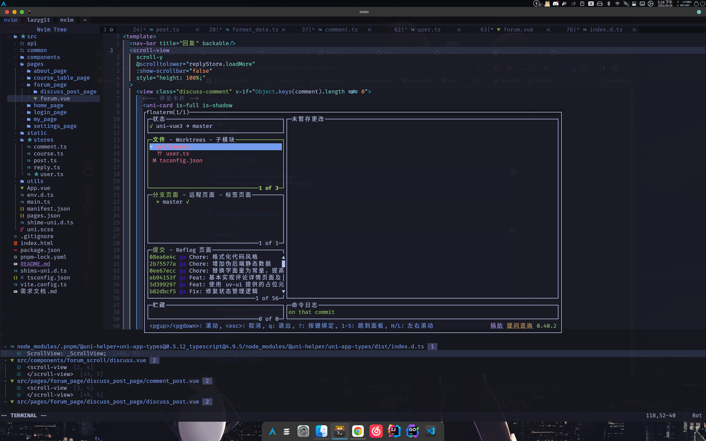
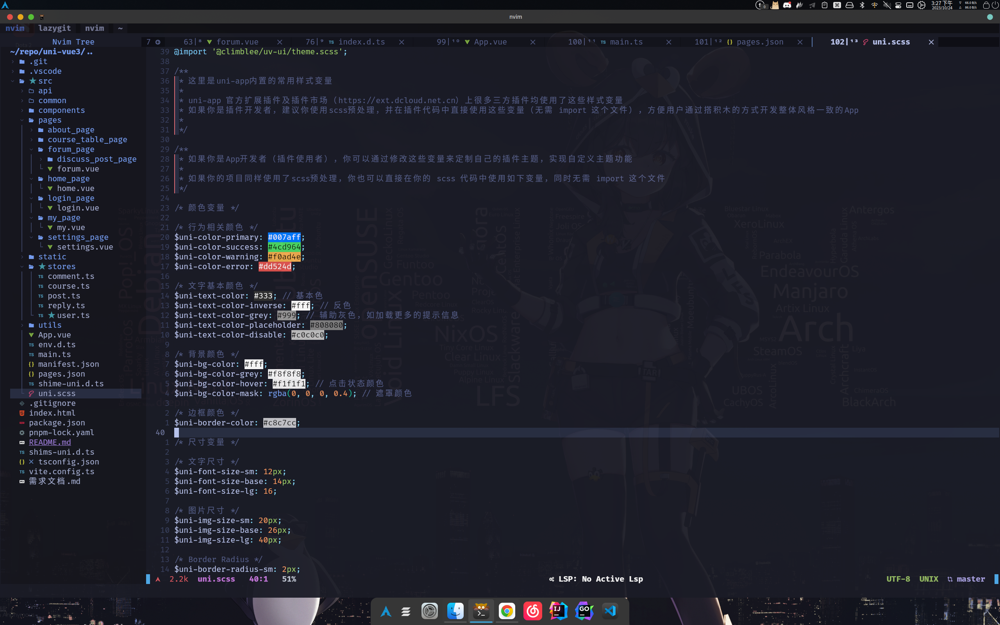
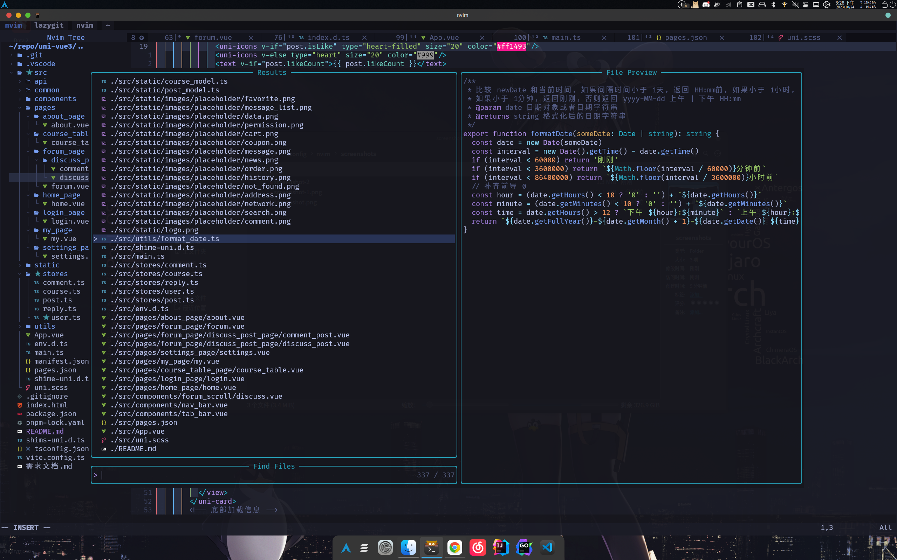

# Personal Neovim repo


<details>
    <summary>More screenshots</summary>
    
    
    
</details>

## How to use?

Clone config
```bash
cd ~/.config
git clone https://github.com/gaogao-qwq/nvim.git
```

Install tree-sitter

> Arch Linux AUR


```bash
yay -S tree-sitter
```

> Debian or Ubuntu


```bash
sudo apt install tree-sitter
```

Install Packer for managing Neovim plugins

> Arch Linux AUR

```bash
yay -S nvim-packer-git
```

> Other distro


```bash
git clone --depth 1 https://github.com/wbthomason/packer.nvim\
 ~/.local/share/nvim/site/pack/packer/start/packer.nvim
```

Install plugins by Packer

```bash
nvim ~/.config/nvim/lua/packer-setup.lua
```

Then just type `:w` and have a nice cup of Libre-tea until Packer get all plugins.
