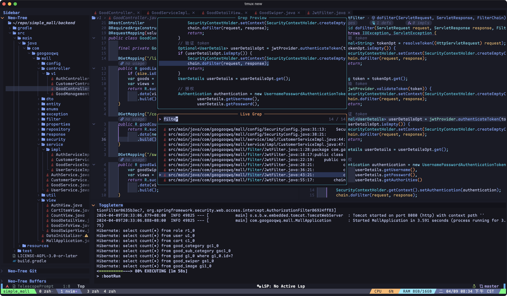

# Personal NeoVim repo

<a href="https://dotfyle.com/gaogao-qwq/nvim"></a>
<a href="https://dotfyle.com/gaogao-qwq/nvim"></a>
<a href="https://dotfyle.com/gaogao-qwq/nvim"></a>




## Requirements

 > Install requires Neovim 0.9+. Always review the code before installing a configuration.
- [nerd-fonts](https://github.com/ryanoasis/nerd-fonts)
- [ripgrep](https://github.com/BurntSushi/ripgrep)
- [node](https://github.com/nodejs/node) (Optional)
- [go](https://github.com/golang/go) (Optional)

## Install Instructions

### Clone config

```bash
cd ~/.config
git clone https://github.com/gaogao-qwq/nvim.git
```

### (Optional)Install jdtls for java LSP support

```bash
just jdtls # Tested on Arch Linux & MacOS.
```

### Install plugins by lazy

Then just open NeoVim and have a nice cup of Libre-tea until Lazy handles
all the problems.

## Plugins

### bars-and-lines

+ [luukvbaal/statuscol.nvim](https://dotfyle.com/plugins/luukvbaal/statuscol.nvim)
### color

+ [folke/twilight.nvim](https://dotfyle.com/plugins/folke/twilight.nvim)
### colorscheme

+ [catppuccin/nvim](https://dotfyle.com/plugins/catppuccin/nvim)
+ [folke/tokyonight.nvim](https://dotfyle.com/plugins/folke/tokyonight.nvim)
### comment

+ [echasnovski/mini.comment](https://dotfyle.com/plugins/echasnovski/mini.comment)
+ [numToStr/Comment.nvim](https://dotfyle.com/plugins/numToStr/Comment.nvim)
+ [danymat/neogen](https://dotfyle.com/plugins/danymat/neogen)
### completion

+ [hrsh7th/nvim-cmp](https://dotfyle.com/plugins/hrsh7th/nvim-cmp)
### debugging

+ [mfussenegger/nvim-dap](https://dotfyle.com/plugins/mfussenegger/nvim-dap)
### editing-support

+ [HiPhish/rainbow-delimiters.nvim](https://dotfyle.com/plugins/HiPhish/rainbow-delimiters.nvim)
+ [folke/zen-mode.nvim](https://dotfyle.com/plugins/folke/zen-mode.nvim)
### file-explorer

+ [nvim-neo-tree/neo-tree.nvim](https://dotfyle.com/plugins/nvim-neo-tree/neo-tree.nvim)
+ [stevearc/oil.nvim](https://dotfyle.com/plugins/stevearc/oil.nvim)
### formatting

+ [stevearc/conform.nvim](https://dotfyle.com/plugins/stevearc/conform.nvim)
### fuzzy-finder

+ [nvim-telescope/telescope.nvim](https://dotfyle.com/plugins/nvim-telescope/telescope.nvim)
### git

+ [lewis6991/gitsigns.nvim](https://dotfyle.com/plugins/lewis6991/gitsigns.nvim)
### icon

+ [nvim-tree/nvim-web-devicons](https://dotfyle.com/plugins/nvim-tree/nvim-web-devicons)
### indent

+ [echasnovski/mini.indentscope](https://dotfyle.com/plugins/echasnovski/mini.indentscope)
+ [lukas-reineke/indent-blankline.nvim](https://dotfyle.com/plugins/lukas-reineke/indent-blankline.nvim)
### lsp

+ [Wansmer/symbol-usage.nvim](https://dotfyle.com/plugins/Wansmer/symbol-usage.nvim)
+ [mrcjkb/rustaceanvim](https://dotfyle.com/plugins/mrcjkb/rustaceanvim)
+ [scalameta/nvim-metals](https://dotfyle.com/plugins/scalameta/nvim-metals)
+ [onsails/lspkind.nvim](https://dotfyle.com/plugins/onsails/lspkind.nvim)
+ [mfussenegger/nvim-jdtls](https://dotfyle.com/plugins/mfussenegger/nvim-jdtls)
+ [neovim/nvim-lspconfig](https://dotfyle.com/plugins/neovim/nvim-lspconfig)
### lsp-installer

+ [williamboman/mason.nvim](https://dotfyle.com/plugins/williamboman/mason.nvim)
### lua-colorscheme

+ [ellisonleao/gruvbox.nvim](https://dotfyle.com/plugins/ellisonleao/gruvbox.nvim)
### markdown-and-latex

+ [iamcco/markdown-preview.nvim](https://dotfyle.com/plugins/iamcco/markdown-preview.nvim)
### media

+ [andweeb/presence.nvim](https://dotfyle.com/plugins/andweeb/presence.nvim)
### motion

+ [folke/flash.nvim](https://dotfyle.com/plugins/folke/flash.nvim)
### note-taking

+ [nvim-orgmode/orgmode](https://dotfyle.com/plugins/nvim-orgmode/orgmode)
### nvim-dev

+ [nvim-lua/plenary.nvim](https://dotfyle.com/plugins/nvim-lua/plenary.nvim)
+ [MunifTanjim/nui.nvim](https://dotfyle.com/plugins/MunifTanjim/nui.nvim)
### plugin-manager

+ [folke/lazy.nvim](https://dotfyle.com/plugins/folke/lazy.nvim)
### preconfigured

+ [LazyVim/LazyVim](https://dotfyle.com/plugins/LazyVim/LazyVim)
### programming-languages-support

+ [akinsho/flutter-tools.nvim](https://dotfyle.com/plugins/akinsho/flutter-tools.nvim)
### scrollbar

+ [petertriho/nvim-scrollbar](https://dotfyle.com/plugins/petertriho/nvim-scrollbar)
### scrolling

+ [karb94/neoscroll.nvim](https://dotfyle.com/plugins/karb94/neoscroll.nvim)
### snippet

+ [L3MON4D3/LuaSnip](https://dotfyle.com/plugins/L3MON4D3/LuaSnip)
### split-and-window

+ [echasnovski/mini.bufremove](https://dotfyle.com/plugins/echasnovski/mini.bufremove)
+ [folke/edgy.nvim](https://dotfyle.com/plugins/folke/edgy.nvim)
### startup

+ [nvimdev/dashboard-nvim](https://dotfyle.com/plugins/nvimdev/dashboard-nvim)
### statusline

+ [nvim-lualine/lualine.nvim](https://dotfyle.com/plugins/nvim-lualine/lualine.nvim)
### syntax

+ [echasnovski/mini.surround](https://dotfyle.com/plugins/echasnovski/mini.surround)
+ [nvim-treesitter/nvim-treesitter](https://dotfyle.com/plugins/nvim-treesitter/nvim-treesitter)
+ [IndianBoy42/tree-sitter-just](https://dotfyle.com/plugins/IndianBoy42/tree-sitter-just)
### tabline

+ [akinsho/bufferline.nvim](https://dotfyle.com/plugins/akinsho/bufferline.nvim)
+ [romgrk/barbar.nvim](https://dotfyle.com/plugins/romgrk/barbar.nvim)
### terminal-integration

+ [akinsho/toggleterm.nvim](https://dotfyle.com/plugins/akinsho/toggleterm.nvim)
### utility

+ [kevinhwang91/nvim-ufo](https://dotfyle.com/plugins/kevinhwang91/nvim-ufo)
+ [folke/noice.nvim](https://dotfyle.com/plugins/folke/noice.nvim)
+ [rcarriga/nvim-notify](https://dotfyle.com/plugins/rcarriga/nvim-notify)
## Language Servers

+ clangd
+ cmake
+ gopls
+ html
+ intelephense
+ jdtls
+ marksman
+ metals
+ pyright
+ taplo
